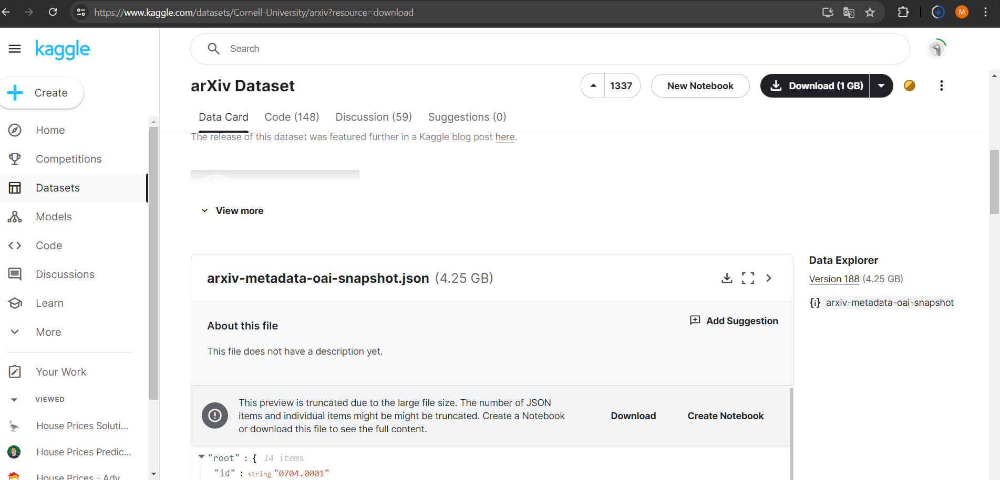

<br />
<div align="center">
  <a href="https://github.com/marendtz"></a>

<h3 align="center">Research Arxiv & ACM</h3>

  <p align="center">    
    <a href="https://arxiv.org/">arXiv</a>
    ·
    <a href="https://dl.acm.org/">ACM Digital Library</a>
  </p>
</div>


<details>
  <summary>Table of Contents</summary>
  <ol>
    <li>
      <a href="#about-the-project">About The Project</a>
    </li>
    <li>
      <a href="#getting-started">Getting Started</a>
      <ul>
        <li><a href="#local-preprocessing-of-necessary-data">Local preprocessing of necessary data</a></li>
        <li><a href="#collab-analysis">Collab analysis</a></li>
      </ul>
    </li>
    <li><a href="#acknowledgments">Acknowledgments</a></li>
  </ol>
</details>


## About The Project (Research Proposal)

This repository helps with the automatic processing of literature obtained within arXiv and ACM during systematic reviews, in order to cluster and categorize the papers in a way the filter functionaly of the systems does not allow. The goal is reduce the amount of papers identified by jointly clustering and categorizing them, so that the most relevant papers can be selected for further analysis in a more efficient way.

<p align="right">(<a href="#readme-top">back to top</a>)</p>


## Getting Started


### Local preprocessing of necessary data

0. Clone repo and install local dependencies
   ```sh
    git clone ...
    cd ...
    pip install virtualenv
    virtualenv venv
    source venv/bin/activate
    pip install -r requirements_local.txt
    ```

2. Get arXiv dump from kaggle
    *  Go to https://kaggle.com/datasets/Cornell-University/arxiv and download metadata into ```./arxiv/data/arxiv-metadata-oai-snapshot.json```
    
    * adapt search string in``./arxiv/prepare_arxic_df.py``, especially in ``def prepare_arxiv_df()`` to filter for the papers you are interested in
    * run script to prepare arXiv data: ```python ./arxiv/prepare_arxiv_df.py``` (result will be provided in ```./arxiv/out/arxiv_df.xlsx```)

3. Get ACM dump from ACM Digital Library: 
    * Go to https://dl.acm.org/search/advanced, filter and download metadata into ```./acm/out/acm.bib```
    * Convert ``.bib`` into ``.xlsx`` and save under ```./acm/out/acm_df.xlsx```

4. Prepare data for clustering
    * copy arXiv and ACM excel files into ```./analysis/in/```
    * run script to prepare analysis: ```python ./analysis/prepare_merged_df.py``` (result will be provided in ```./analysis/intermediate/merged_df.xlsx```)


<p align="right">(<a href="#readme-top">back to top</a>)</p>

### Collab analysis

Go to Google Collab and open the notebook ```./analysis/analysis.ipynb``` and perform analysis.


<p align="right">(<a href="#readme-top">back to top</a>)</p>


## Acknowledgments

* for UMAP setup: https://pair-code.github.io/understanding-umap/

<p align="right">(<a href="#readme-top">back to top</a>)</p>


